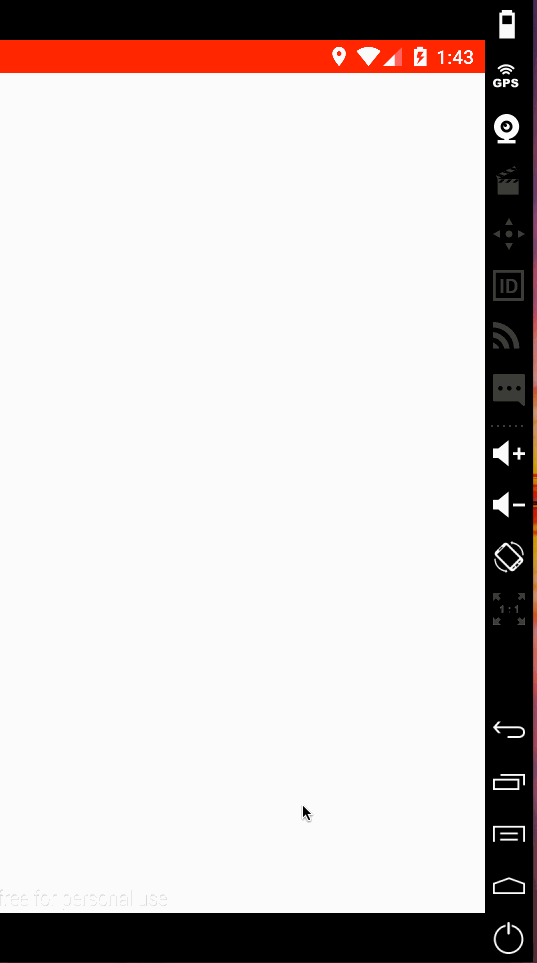

xReddit     
=======
[](https://travis-ci.org/KevinOfNeu/xReddit)

[Reddit](https://www.reddit.com/) for Android, made with[React-Native](https://github.com/facebook/react-native).   
Adding support for iOS is on the way, adding support for OSX is also in plan!!!



## Build & Run
### s1
```
npm install
```

### s2
```
react-native run-android
```

### s3
If you came up with 'reload' issues, try run  ```npm start```

## Future Improvement
* iOS version
* Listing Comments
* OSX version
* more channels
* custom setting

License
-------------
<a href=/LICENSE.txt" target="_blank">MIT</a> license.


### From Kevin
We would like xReddit to evolve, so we are open to your help, suggestions and feedback. Welcome Star,Fork,PR and Issue!

Enjoy!

Made with ♥ by [Kevin](http://kevin.doyeden.com).